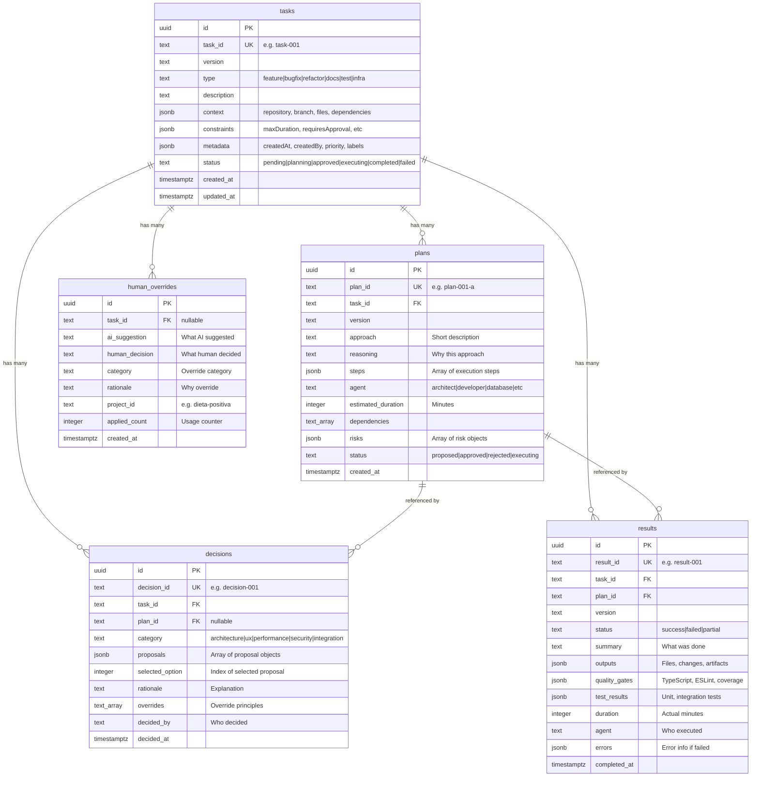
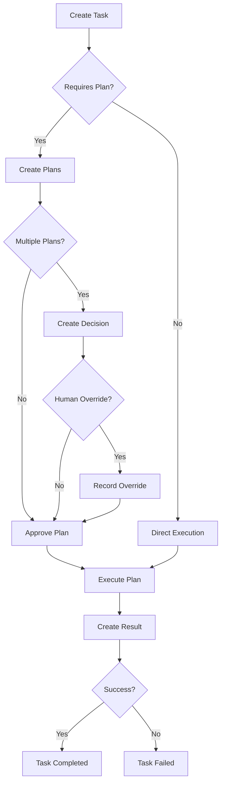

# Database Entity Relationship Diagram

## Schema Overview

This diagram shows the relationships between all tables in the Aura MVP database.



## Cascade Behavior

### ON DELETE CASCADE
When a task is deleted, these are automatically deleted:
- All plans for that task
- All decisions for that task
- All results for that task
- All human overrides for that task

### ON DELETE SET NULL
When a plan is deleted:
- Decisions that reference it have `plan_id` set to NULL
- This preserves the decision history even if the plan is removed

## Indexes

### tasks
- `idx_tasks_status` - Fast queries by status
- `idx_tasks_type` - Fast queries by type
- `idx_tasks_created_at` - Fast queries ordered by date (descending)

### plans
- `idx_plans_task_id` - Fast lookups of plans for a task
- `idx_plans_status` - Fast queries by plan status

### decisions
- `idx_decisions_task_id` - Fast lookups of decisions for a task
- `idx_decisions_category` - Fast queries by decision category

### results
- `idx_results_task_id` - Fast lookups of results for a task
- `idx_results_status` - Fast queries by result status

### human_overrides
- `idx_overrides_category` - Fast queries by category
- `idx_overrides_project` - Fast queries by project

## Data Flow



## Common Queries

### Get all tasks with their plan count
```sql
SELECT
  t.task_id,
  t.description,
  t.status,
  COUNT(p.id) as plan_count
FROM tasks t
LEFT JOIN plans p ON t.task_id = p.task_id
GROUP BY t.task_id, t.description, t.status
ORDER BY t.created_at DESC;
```

### Get task with all related data
```sql
SELECT
  t.*,
  json_agg(DISTINCT p.*) as plans,
  json_agg(DISTINCT d.*) as decisions,
  json_agg(DISTINCT r.*) as results
FROM tasks t
LEFT JOIN plans p ON t.task_id = p.task_id
LEFT JOIN decisions d ON t.task_id = d.task_id
LEFT JOIN results r ON t.task_id = r.task_id
WHERE t.task_id = 'task-001'
GROUP BY t.id;
```

### Get tasks awaiting approval
```sql
SELECT t.*, COUNT(p.id) as plan_count
FROM tasks t
LEFT JOIN plans p ON t.task_id = p.task_id AND p.status = 'proposed'
WHERE t.status = 'planning'
GROUP BY t.id
HAVING COUNT(p.id) > 0;
```

### Get human overrides by frequency
```sql
SELECT
  category,
  ai_suggestion,
  human_decision,
  applied_count
FROM human_overrides
ORDER BY applied_count DESC;
```

## JSONB Structure Examples

### tasks.context
```json
{
  "repository": "dieta-positiva",
  "branch": "feature/dp-ai-chat",
  "files": ["src/app/(auth)/chat/page.tsx", "src/components/chat/"],
  "dependencies": ["@supabase/supabase-js", "framer-motion"]
}
```

### tasks.constraints
```json
{
  "maxDuration": 180,
  "requiresApproval": true,
  "breakingChangesAllowed": false,
  "testCoverageMin": 80
}
```

### tasks.metadata
```json
{
  "createdAt": "2025-12-31T12:00:00Z",
  "createdBy": "Virgilio",
  "priority": "high",
  "labels": ["dp-ai", "chat", "frontend"]
}
```

### plans.steps
```json
[
  {
    "id": "step-1",
    "agent": "developer",
    "action": "Create chat UI components",
    "inputs": ["Next.js App Router", "Tailwind CSS"],
    "outputs": ["src/app/(auth)/chat/page.tsx"],
    "validation": {
      "command": "npm run type-check && npm run lint",
      "successCriteria": "No TypeScript or ESLint errors"
    },
    "dependencies": []
  }
]
```

### plans.risks
```json
[
  {
    "description": "Supabase vendor lock-in",
    "severity": "medium",
    "mitigation": "Can migrate to self-hosted Postgres + custom WebSocket later"
  }
]
```

### decisions.proposals
```json
[
  {
    "approach": "Next.js + Supabase Realtime",
    "reasoning": "Leverage existing stack, faster development",
    "tradeoffs": {
      "pros": ["Fast development", "Built-in features"],
      "cons": ["Vendor lock-in", "Less control"],
      "risks": ["Free tier limitations"]
    }
  }
]
```

### results.quality_gates
```json
{
  "typescript_check": {
    "passed": true,
    "errors": 0,
    "warnings": 2
  },
  "eslint_check": {
    "passed": true,
    "errors": 0,
    "warnings": 3
  },
  "test_coverage": {
    "passed": true,
    "coverage": 87.5,
    "threshold": 85
  }
}
```

## Row Level Security

All tables have RLS enabled with permissive policies for MVP:

```sql
-- Current policy (single user MVP)
CREATE POLICY "Allow all operations" ON [table] FOR ALL USING (true);
```

For multi-user production, update to:

```sql
-- Example: Users can only access their own tasks
CREATE POLICY "Users can view own tasks"
  ON tasks FOR SELECT
  USING (metadata->>'createdBy' = auth.jwt()->>'email');

CREATE POLICY "Users can create own tasks"
  ON tasks FOR INSERT
  WITH CHECK (metadata->>'createdBy' = auth.jwt()->>'email');
```
